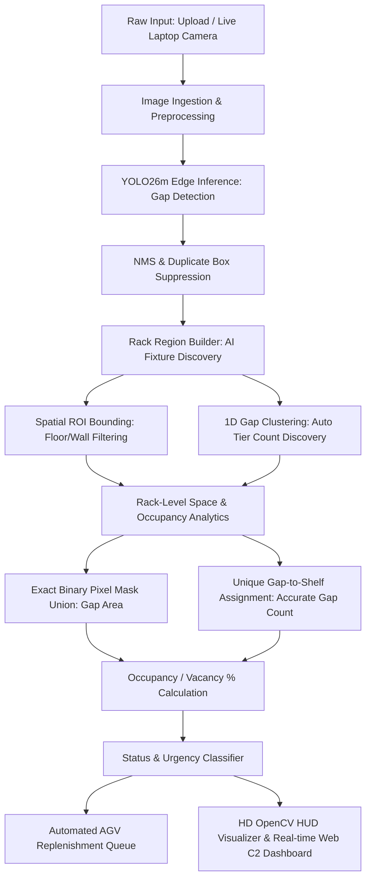

# 🚀 RackVision AI: End-to-End Architecture & Operational Workflow
**Digital Solutions BU — Operational Warehouse Intelligence & Command & Control Center**

---

## 📌 Executive Summary & Problem Statement
* **Industry Challenge:** Manual warehouse shelf and rack inspections are slow, labor-intensive, error-prone, and delay replenishment turnaround, resulting in stockouts and lost revenue.
* **Our Solution:** **RackVision AI** is an autonomous edge computer-vision pipeline that transforms raw camera/warehouse imagery into real-time shelf inventory intelligence, automated restock queues, and interactive Command & Control (C2) operations.

---

## 🔄 End-to-End Pipeline Architecture

---

## 🧩 Stage-by-Stage Technical Breakdown

### 1. Ingestion & Preprocessing
* **Input Sources:**
  1. **Image Files:** JPG, JPEG, PNG, WebP (warehouse photos, high-angle surveillance feeds).
  2. **Live Laptop Camera:** Direct browser video capture stream (`navigator.mediaDevices.getUserMedia`) sampled via HTML5 canvas snapshot or continuous frame streaming.
* **Resolution & Normalization:**
  - Input images are decoded via OpenCV (`cv2.imdecode`) into standard **BGR uint8** arrays.
  - Sized for inference at default `640x640` input dimensions (`imgsz=640`) while maintaining spatial aspect ratios.
* **Key Function:** [`read_image_from_upload()`](file:///d:/yolo/empty-shelves/app.py#L145-L165) in `app.py`.

---

### 2. Deep Learning Gap Detection (YOLO26m)
* **Model:** Ultralytics YOLO26m (`models/empty-shelves-yolo26m.pt`).
* **Class Identified:** Class `0: 'gap'` (empty, unstocked space between products on shelves).
* **Inference Mechanics:**
  - Forward pass on CPU/GPU with configurable confidence threshold (default `conf=0.20`, range `0.05` to `0.80`).
  - Standard Non-Maximum Suppression (NMS) with IoU threshold `0.35`.
* **Application-Level Box Sanity Filtering & Suppression:**
  - **Noise Filter:** Removes tiny artifacts below `MIN_BOX_AREA_RATIO = 0.0001` (0.01% of image).
  - **Upper Bound:** Caps large background false positives at `MAX_BOX_AREA_RATIO = 0.90`.
  - **Overlap Suppression:** Suppresses duplicate overlapping candidate boxes (`OVERLAP_IOU_THRESHOLD = 0.50`, `CONTAINMENT_THRESHOLD = 0.85`), prioritizing the tighter, higher-confidence box.
* **Key Functions:**
  - [`extract_candidate_boxes()`](file:///d:/yolo/empty-shelves/app.py#L167-L215) in `app.py`
  - [`suppress_duplicate_boxes()`](file:///d:/yolo/empty-shelves/app.py#L216-L275) in `app.py`

---

### 3. Intelligent Rack Region Builder (Fixture Discovery & Background Exclusion)
* **The Problem It Solves:** Full-image grid slicing falsely captures non-rack areas (carpets/floors below the shelf, walls/ceilings above) as "100% stocked" shelves.
* **Step 3A — Spatial Rack ROI Bounding:**
  - Computes the bounding perimeter $[X_{\text{min}}, Y_{\text{min}}, X_{\text{max}}, Y_{\text{max}}]$ spanning all detected gaps with horizontal padding ($5\% W$) and vertical padding ($12\% H_{\text{median}}$).
  - **Result:** Tightly isolates the physical shelf fixture, cutting off floors below and walls above.
* **Step 3B — 1D Gap Alignment Clustering (Shelf Tier Discovery):**
  - Extracts gap vertical centers: $y_{\text{center}} = \frac{y_1 + y_2}{2}$.
  - Clusters gaps along horizontal baselines using an adaptive distance threshold:
    $$\text{cluster\_dist\_thresh} = \max(16\text{px},\ \text{median\_gap\_height} \times 0.60)$$
  - Groups gaps sitting on the same physical shelf level to automatically discover the true tier count $K$ (e.g. 2, 3, 4, 5 tiers) without manual configuration.
* **Step 3C — Shelf Boundary Partitioning:**
  - Computes midpoint cutoff lines between adjacent cluster centers to define clean bounding boxes for each shelf unit: $\text{RACK-A-T1}$, $\text{RACK-A-T2}$, ..., $\text{RACK-A-T}K$.
* **Key Class:** [`RackRegionBuilder.build_regions()`](file:///d:/yolo/empty-shelves/rack_analytics.py#L104-L282) in `rack_analytics.py`.

---

### 4. Rack-Level Space & Occupancy Analytics

#### A. Unique Gap-to-Shelf Assignment (Accurate Gap Count)
* Prevents double-counting gaps that touch horizontal tier partition borders.
* Evaluates each gap box against all shelf regions $[rx_1, ry_1, rx_2, ry_2]$:
  - Calculates intersection area $\text{Area}_{\text{inter}} = \max(0, ix_2 - ix_1) \times \max(0, iy_2 - iy_1)$.
  - Heavily weights center-point containment: $(gcx, gcy) \in [rx_1, rx_2] \times [ry_1, ry_2]$.
  - Assigns each gap **uniquely to exactly one shelf tier**.
  - **Guarantee:** $\sum \text{rack.gap\_count} = \text{total\_detected\_gaps}$.

#### B. Exact Pixel Mask Union (Occupancy & Vacancy Area)
* Handles overlapping gap detections without double-counting pixels:
  1. Allocates a 2D binary matrix $\text{Mask}$ of dimensions $(\text{rack\_height}, \text{rack\_width})$.
  2. Projects intersecting gap sub-rectangles onto the mask with value `1`.
  3. Counts nonzero elements: $\text{GapArea}_{\text{px}} = \sum \text{Mask}$.

#### C. Core Mathematical Formulas
$$\text{RackArea}_{\text{px}} = (rx_2 - rx_1) \times (ry_2 - ry_1)$$
$$\text{OccupiedArea}_{\text{px}} = \max(0,\ \text{RackArea}_{\text{px}} - \text{GapArea}_{\text{px}})$$
$$\text{Occupancy \%} = \left( \frac{\text{OccupiedArea}_{\text{px}}}{\text{RackArea}_{\text{px}}} \right) \times 100$$
$$\text{Vacancy \%} = \left( \frac{\text{GapArea}_{\text{px}}}{\text{RackArea}_{\text{px}}} \right) \times 100$$

* **Key Functions:**
  - [`compute_gap_union_area_in_region()`](file:///d:/yolo/empty-shelves/rack_analytics.py#L284-L322) in `rack_analytics.py`
  - [`analyze_rack_fleet()`](file:///d:/yolo/empty-shelves/rack_analytics.py#L352-L485) in `rack_analytics.py`

---

### 5. Status Classification & Automated Restock Queue
Each shelf tier is classified based on its occupancy percentage:

| Occupancy % | Operational Status | Urgency Rating | Action Triggered | Estimated Units Needed |
|---|---|---|---|---|
| **≥ 75.0%** | `STOCKED` | `NONE` | Fully Stocked — Normal Monitoring | 0 |
| **40.0% – 74.9%** | `PARTIAL` | `MEDIUM` | Moderate Stock — Monitor Next Cycle | $(100 - \text{Occ}) \times 0.5$ |
| **15.0% – 39.9%** | `LOW_STOCK` | `HIGH` | Low Stock Warning — Schedule Replenishment | $(100 - \text{Occ}) \times 0.8$ |
| **< 15.0%** | `EMPTY` | `CRITICAL` | Critical Out-of-Stock — Immediate AGV Dispatch | $100 - \text{Occ}$ |

* **Automated Dispatch Queue:** Generates priority orders (`ORD-XXXXXX`) sorted by urgency (`CRITICAL` $\to$ `HIGH` $\to$ `MEDIUM`) with timestamps and recommended restock unit counts.
* **Key Function:** [`classify_rack_status()`](file:///d:/yolo/empty-shelves/rack_analytics.py#L324-L350) in `rack_analytics.py`.

---

### 6. Command & Control Visualization & HUD Rendering
* **OpenCV HUD Rendering Engine:**
  - **Shelf Brackets:** Neon status-coded perimeter frames (Green = Stocked, Cyan = Partial, Amber = Low Stock, Red = Empty).
  - **Shelf HUD Badges:** Displays `RACK-ID | STATUS (OCCUPANCY %)`.
  - **Progress Bars:** Embedded bottom progress bars on each shelf showing visual fill levels.
  - **Gap Outlines:** Bright cyan bounding boxes with confidence scores (`GAP 0.89`).
  - **Heatmap (Optional):** Jet-colormap density overlay highlighting concentrated empty space.
* **Web UI Dashboard (`static/index.html`):**
  - Real-time KPI deck (Fill Rate, Shelf Count, Restock Alerts, Latency).
  - Interactive rack matrix table and 1-click AGV fleet dispatch simulation.
  - Live laptop camera stream with dynamic canvas overlays.
  - Export capabilities for CSV and JSON telemetry.
* **Key Function:** [`render_rackvision_overlay()`](file:///d:/yolo/empty-shelves/rack_analytics.py#L486-L630) in `rack_analytics.py`.

---

## 🗂️ Complete Codebase & Function Reference

| Module / File | Core Class / Function | Purpose & Responsibility |
|---|---|---|
| [`rack_analytics.py`](file:///d:/yolo/empty-shelves/rack_analytics.py) | `RackRegionBuilder.build_regions()` | Auto-discovers physical rack ROI and derives shelf tiers via 1D gap alignment clustering. |
| [`rack_analytics.py`](file:///d:/yolo/empty-shelves/rack_analytics.py) | `compute_gap_union_area_in_region()` | Calculates exact pixel mask union area of empty gaps on a shelf. |
| [`rack_analytics.py`](file:///d:/yolo/empty-shelves/rack_analytics.py) | `classify_rack_status()` | Maps occupancy percentage to operational status, urgency, and actions. |
| [`rack_analytics.py`](file:///d:/yolo/empty-shelves/rack_analytics.py) | `analyze_rack_fleet()` | Orchestrates full fleet analytics, unique gap assignment, and dispatch order generation. |
| [`rack_analytics.py`](file:///d:/yolo/empty-shelves/rack_analytics.py) | `render_rackvision_overlay()` | Renders HD OpenCV HUD overlays (brackets, status badges, progress bars, gap boxes). |
| [`app.py`](file:///d:/yolo/empty-shelves/app.py) | `POST /api/rack-analyze` | REST API returning full JSON telemetry (occupancy, shelf metadata, restock queue). |
| [`app.py`](file:///d:/yolo/empty-shelves/app.py) | `POST /api/rack-visualize` | REST API rendering and streaming annotated HUD visual JPEG images. |
| [`app.py`](file:///d:/yolo/empty-shelves/app.py) | `POST /api/replenishment/dispatch` | Dispatches simulated autonomous mobile robot (AGV) units with ETA. |
| [`app.py`](file:///d:/yolo/empty-shelves/app.py) | `suppress_duplicate_boxes()` | Removes duplicate candidate bounding boxes and filters extreme area ratios. |
| [`scripts/predict_clean.py`](file:///d:/yolo/empty-shelves/scripts/predict_clean.py) | `main()` | Standalone CLI tool for headless warehouse batch processing and terminal ASCII reports. |
| [`static/index.html`](file:///d:/yolo/empty-shelves/static/index.html) | Web C2 Control Station | Full single-page Command & Control Center UI with webcam streaming and telemetry decks. |

-----------------------------------------------------------------

1. How it cuts out the Floor and Wall (Rack Bounding)
The Problem: The raw camera photo contains empty walls above the rack and carpet/floor below the rack. If we analyze the whole photo, the floor gets falsely counted as a "100% stocked shelf".
How We Solve It:
The YOLO AI first detects all the empty gaps (empty spaces between items).
Because empty gaps only exist on shelves, the system looks at the topmost, bottommost, leftmost, and rightmost gap positions:
Top edge of rack = Highest gap detected (plus a small shelf margin).
Bottom edge of rack = Lowest gap detected (plus a small shelf margin).
Everything above that top edge (wall/ceiling) and below that bottom edge (floor/carpet) is cut off and ignored.
2. How it counts the Number of Shelves (Auto-Tier Count)
The Intuition: Products and gaps on the same shelf row sit along the same horizontal level (horizontal line).
How We Solve It:
The code takes the vertical center point of every detected gap: (y1 + y2) / 2.
It groups/clusters gaps that share roughly the same horizontal height line into a single row.
The number of clusters = The number of physical shelf levels (e.g. 2 shelves, 3 shelves, 5 shelves).
It automatically draws the shelf boundaries between these clusters.

-----------------------------------------------------

how duplicate gaps are removed and prevented, in simple words:

1. Removing Duplicate Bounding Boxes (At the AI Detection Level)
When YOLO detects an empty space, it might predict two or three overlapping boxes for the exact same gap (one slightly larger, one tighter).

How We Solve It (suppress_duplicate_boxes in 

app.py
):
Sort by Confidence: We take the highest-confidence detected boxes first.
Overlap Check (IoU & Containment): If a new box overlaps an already accepted box by more than $50%$ (IoU ≥ 0.50) or is mostly inside it (Containment ≥ 0.85), it is flagged as a duplicate.
Pick the Best/Tighter Box: If the smaller box has strong confidence, we keep the tighter box and discard the redundant larger box.
2. Preventing Double-Counting Across Shelves (At the Shelf Assignment Level)
A single gap box might sit near the border between Shelf 1 and Shelf 2. If we just check for overlap, both shelves would claim that gap, causing the gap count to double.

How We Solve It (analyze_rack_fleet in 

rack_analytics.py
):
Center-Point & Maximum Overlap Rule: For every detected gap, we check which shelf holds its center point $(x_{\text{center}}, y_{\text{center}})$ and the largest portion of its area.
Unique Assignment: Each gap is assigned to only one shelf (the shelf where it primarily sits).
Result: No gap is ever counted twice, and the sum of gaps across all shelves always matches the total number of physical gaps in the image.
3. Preventing Double-Counting of Empty Area (At the Pixel Level)
If two gap boxes slightly touch or overlap on the same shelf, we shouldn't add their areas together (e.g. $100\text{px} + 100\text{px} = 200\text{px}$ is wrong if they overlap by $30\text{px}$).

How We Solve It (compute_gap_union_area_in_region in 

rack_analytics.py
):
Binary Pixel Mask: We paint all the gap boxes onto a 2D pixel grid where empty pixels are marked as 1.
Union Area: We count the unique 1 pixels. Overlapping pixels are merged automatically and counted only once.

----------------------------------------------

Why our Default is 0.20 (The Sweet Spot for Warehouses)
Setting | Confidence Level | Behavior in Warehouse
---|---|---
Too Low | < 0.15 | Catches false gaps from dark shadows or barcodes.
Optimal (Our App) | 0.20 | Captures real empty shelf spaces across varying lighting, while our secondary size & overlap filters filter out any noise.
Too High | > 0.50 | Misses genuine gaps located in darker shelf tiers or low-light aisles.
